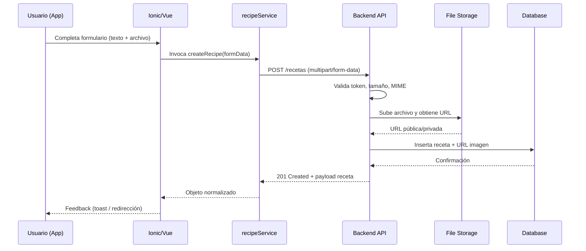

# Diagrama de Secuencia – Carga de Imagen + Creación de Receta

```mermaid
sequenceDiagram
    participant U as Usuario (App)
    participant UI as Ionic/Vue
    participant SV as recipeService
    participant API as Backend API
    participant FS as File Storage
    participant DB as Database

    U->>UI: Completa formulario (texto + archivo)
    UI->>SV: Invoca createRecipe(formData)
    SV->>API: POST /recetas (multipart/form-data)
    API->>API: Valida token, tamaño, MIME
    API->>FS: Sube archivo y obtiene URL
    FS-->>API: URL pública/privada
    API->>DB: Inserta receta + URL imagen
    DB-->>API: Confirmación
    API-->>SV: 201 Created + payload receta
    SV-->>UI: Objeto normalizado
    UI-->>U: Feedback (toast / redirección)
```

