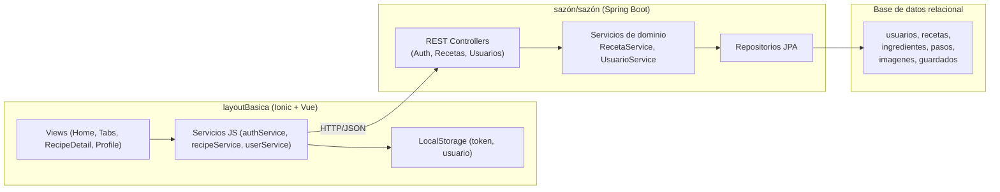

### Descripción

- **Views**: Componentes Ionic (por ejemplo `Tab1Page.vue`, `Tab3Page.vue`) que orquestan formularios y navegación.  
- **Servicios JS**: Encapsulan `fetch`, construyen URLs con `getApiUrl()` y adjuntan Bearer tokens almacenados.  
- **Controladores Spring**: Validan peticiones, convierten entidades a DTO y delegan en los servicios de dominio.  
- **Servicios de dominio**: Contienen las reglas (validación de autoría, publicación/borrador, estadísticas).  
- **Repositorios JPA**: Mapas a las tablas físicas definidas en `schema.sql`.  
- **Base de datos**: Modelo relacional con UUID como claves primarias, relaciones 1:N (usuarios-recetas, recetas-ingredientes/pasos/imagenes) y tabla puente `guardados`.

