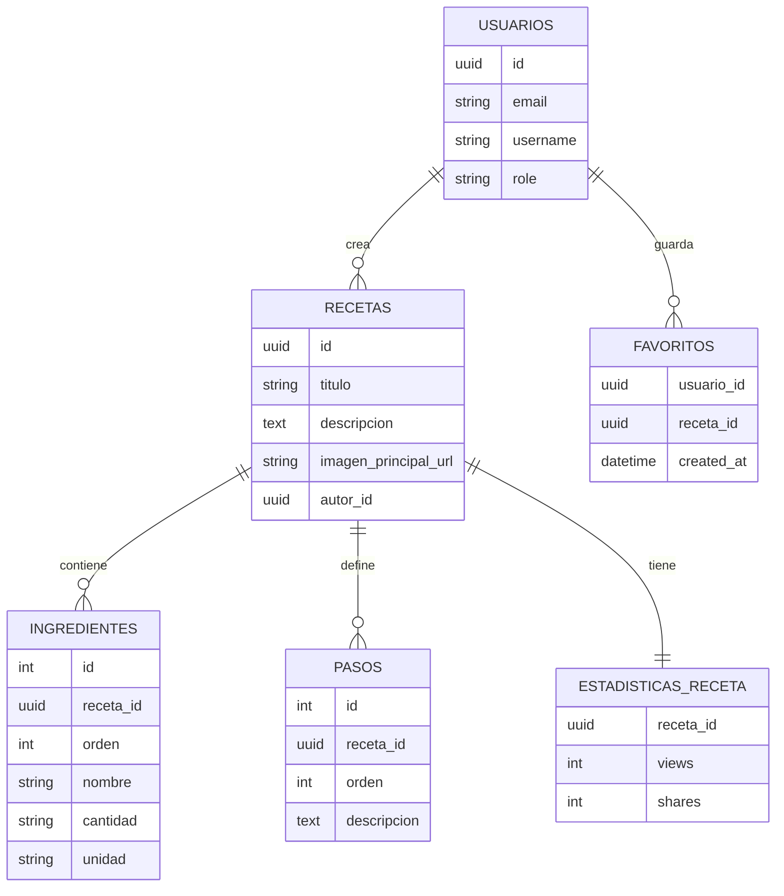
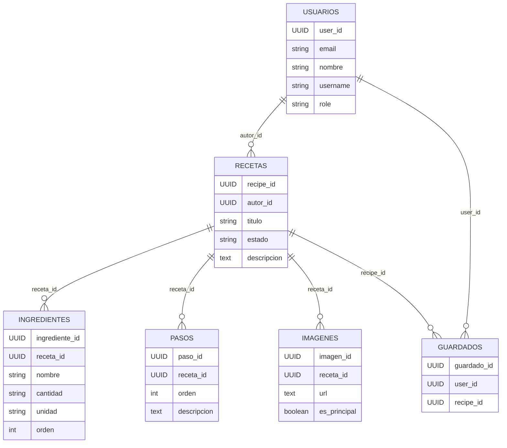

# Diagrama Entidad-Relación

### Notas
- Todas las claves primarias usan UUID (ver anotaciones `@GeneratedValue(strategy = GenerationType.UUID)` en las entidades).  
- `Guardados` funciona como tabla puente para representar favoritos (muchos a muchos entre usuarios y recetas).  
- Columnas `orden` en ingredientes/pasos preservan el orden definido por el autor (ver `@OrderBy("orden ASC")` en `Receta`).  
- Las imágenes se almacenan como URL + metadatos (`storageKey`, dimensiones) para permitir migrar a almacenamiento externo.*** End Patch

