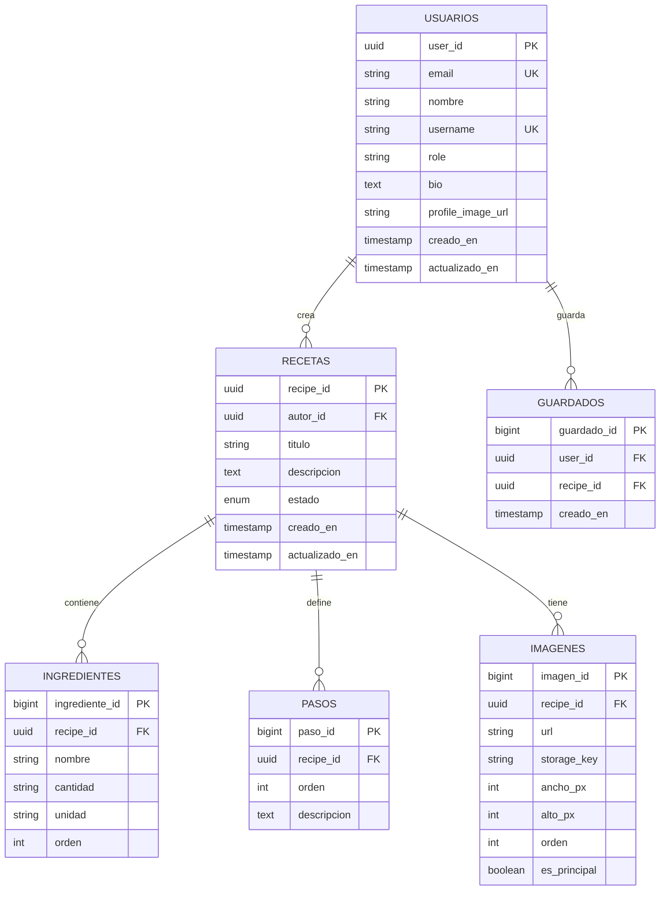
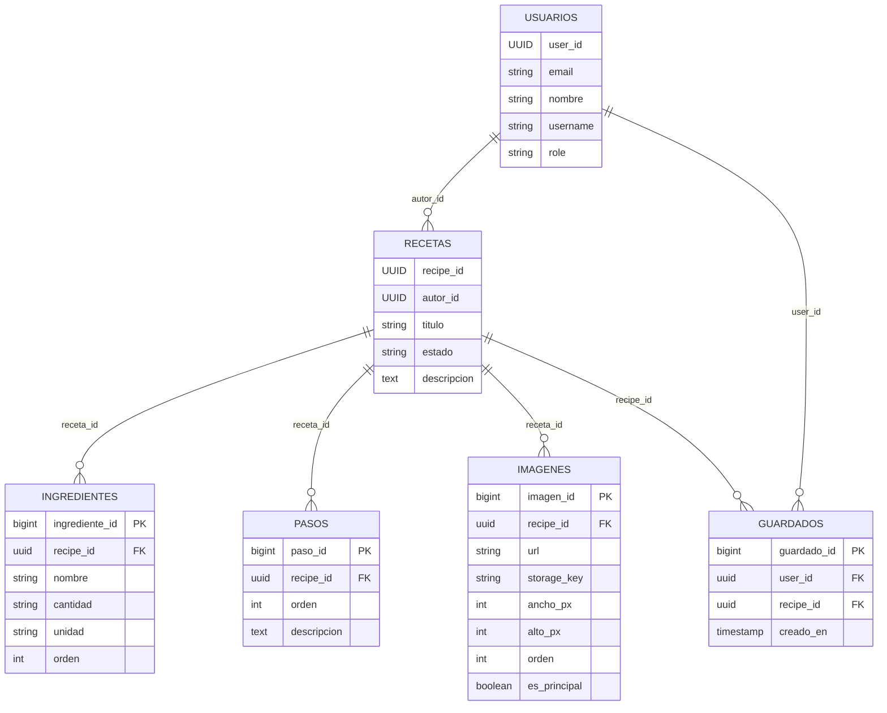

# Diagrama Entidad-Relación

### Notas
- **Claves primarias:**
  - `usuarios.user_id` y `recetas.recipe_id` usan UUID (ver `@GeneratedValue(strategy = GenerationType.UUID)`).
  - `ingredientes.ingrediente_id`, `pasos.paso_id`, `imagenes.imagen_id` y `guardados.guardado_id` usan BIGINT con auto-incremento (ver `@GeneratedValue(strategy = GenerationType.IDENTITY)`).
- **Tabla `guardados`:** Funciona como tabla puente para representar favoritos (muchos a muchos entre usuarios y recetas). Tiene constraint único en `(user_id, recipe_id)`.
- **Orden:** Columnas `orden` en ingredientes/pasos/imágenes preservan el orden definido por el autor (ver `@OrderBy("orden ASC")` en `Receta`).
- **Imágenes:** Se almacenan en tabla separada `imagenes` con metadatos (`storage_key`, `ancho_px`, `alto_px`, `orden`, `es_principal`) para permitir múltiples imágenes por receta y migrar a almacenamiento externo.
- **Estados de receta:** `BORRADOR`, `PUBLICADA`, `ELIMINADA` (eliminación lógica).
- **Estadísticas:** No existe tabla `estadisticas_receta`. Las estadísticas se calculan dinámicamente en el servicio.

